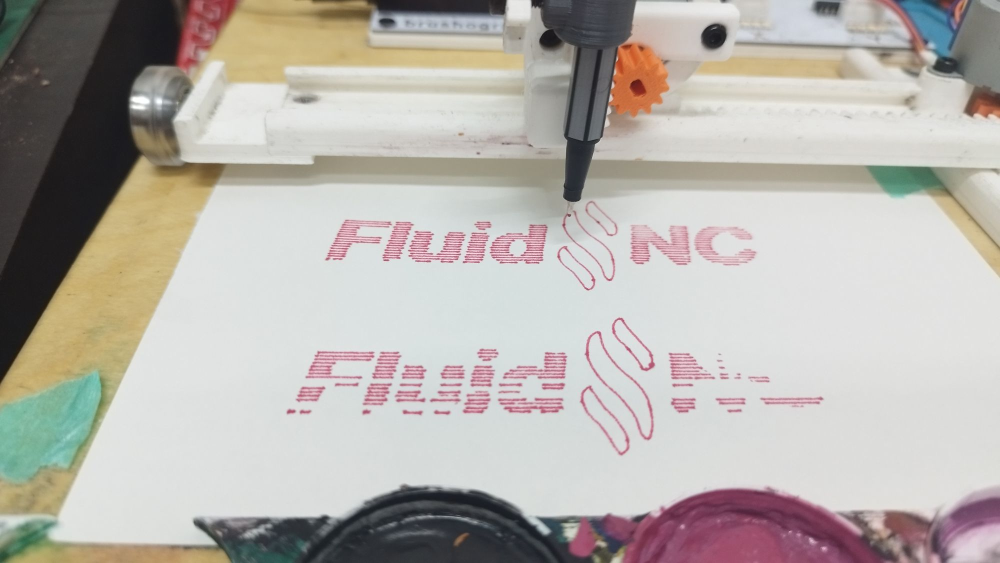

# FluidNC Firmware Modification: Realtime Z-Babystepping



This document details the changes made to the `FluidNC` source code to implement realtime, planner-bypassing Z-axis nudging (0.1mm increments).

## Context: The openBrushograph
This modification was developed for the **[openBrushograph](https://github.com/openBrushograph/openBrushograph)** project.
The openBrushograph is a drawing machine where precise control over the brush height (Z-axis) is critical. Standard G-code streams suffer from planner buffering, causing a delay between sending a command and the machine executing it.

**The Goal:** We needed a way to "nudge" the brush up or down *instantly* while the machine is drawing, without pausing or waiting for the buffer to empty. This allows the user to fine-tune the brush pressure and lift height on the fly to correct for paper irregularities or brush variations.

*   **Wiki / More Info:** [openBrushograph Wiki](https://wiki.sgmk-ssam.ch/wiki/Brushograph)
*   **Fork Source:** [FluidNC-Z-Offset](https://github.com/openBrushograph/FluidNC-Z-Offset)

## Base Firmware Context
*   **Base Fork:** This project is based on **FluidNC v3.9.6** (specifically a fork by **g1smo**).
*   **Key Feature of Base:** Added support for **ULN2003** stepper drivers (which was removed in official FluidNC releases after v3.8.4).
*   **Source:** [https://git.kompot.si/g1smo/FluidNC](https://git.kompot.si/g1smo/FluidNC)

## Overview of Changes
We intercepted the command stream to recognize two new custom characters (`0xB0` and `0xB1`). these triggers calculate the exact number of stepper pulses required for a **0.1mm** move (based on the machine's `steps_per_mm` setting) and inject them into the stepper interrupt loop.

### 1. New Commands Defined
**File:** `FluidNC/src/RealtimeCmd.h`
**Change:** Added two entries to the `Cmd` enum.
```cpp
enum class Cmd : uint8_t {
    // ...
    BabystepZUp           = 0xB0, // Extended ASCII 176 -> Moves Z +0.1mm
    BabystepZDown         = 0xB1, // Extended ASCII 177 -> Moves Z -0.1mm
};
```

### 2. Command Parsing & Step Calculation
**File:** `FluidNC/src/RealtimeCmd.cpp`
**Change:**
1.  Added dispatch cases for `0xB0` and `0xB1`.
2.  **Logic:** Reads the Z-axis `steps_per_mm` from config, calculates steps for 0.1mm (`round(steps_per_mm * 0.1)`), and passes this integer value to the protocol event.

```cpp
case Cmd::BabystepZUp: {
    float steps_mm = config->_axes->_axis[Z_AXIS]->_stepsPerMm;
    int steps = round(steps_mm * 0.1f);
    if (steps < 1) steps = 1;
    protocol_send_event(&babystepEvent, (void*)steps);
    break;
}
```

### 3. Protocol Event Handling
**File:** `FluidNC/src/Protocol.cpp`
**Change:** The `babystepEvent` handler now accepts an `int` (number of steps) instead of a boolean value. It calls `Stepper::babystep(Z_AXIS, steps)`.

### 4. Stepper Implementation (The Core)
**File:** `FluidNC/src/Stepper.cpp`
**Change 1:** `babystep` function adds the requested steps to a volatile accumulator (`babystep_accumulator[Z_AXIS]`).

**Change 2 (Pulse Injection):**
Inside `pulse_func()`, after the standard planner block steps are executed, we check the accumulator. If steps are pending, and the Z-axis isn't already stepping this cycle, we:
1.  Force the Z step bit high.
2.  Set the direction bit based on the accumulator sign.
3.  Decrement the accumulator.

### 5. Bug Fix: Double-Stepping Issue
**Symptoms:** Machine coordinates and movements were exactly **2x** the expected values.
**Cause:** A duplicate `config->_axes->step(...)` call was accidentally left in `Stepper.cpp`.
**Fix:** Removed the duplicate line.

