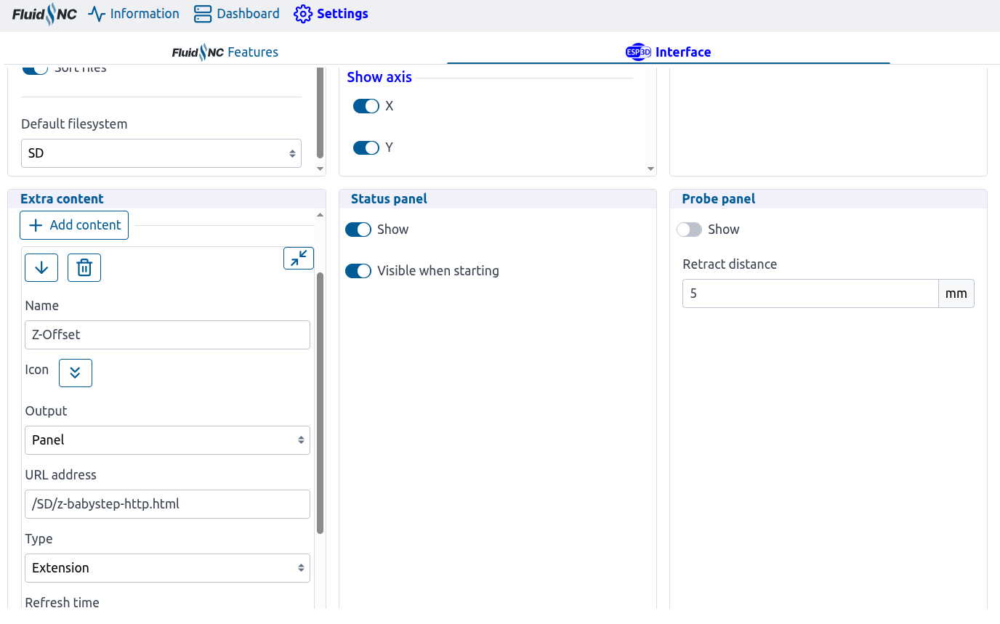
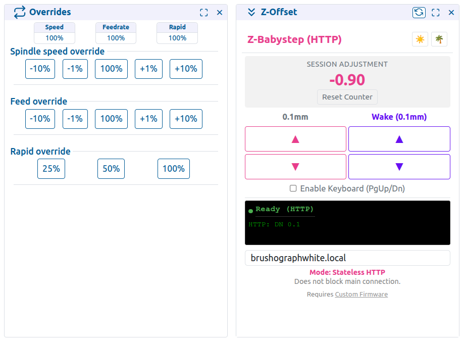

# FluidNC Firmware Modification: Realtime Z-Babystepping


This document details the changes made to the `FluidNC` source code to implement realtime, planner-bypassing Z-axis nudging (0.1mm and 0.5mm increments).

## Context: The openBrushograph
This modification was developed for the **[openBrushograph](https://github.com/openBrushograph/openBrushograph)** project.
The openBrushograph is a drawing machine where precise control over the brush height (Z-axis) is critical. Standard G-code streams suffer from planner buffering, causing a delay between sending a command and the machine executing it.

**The Goal:** We needed a way to "nudge" the brush up or down *instantly* while the machine is drawing, without pausing or waiting for the buffer to empty. This allows the user to fine-tune the brush pressure and lift height on the fly to correct for paper irregularities or brush variations.

*   **Wiki / More Info:** [openBrushograph Wiki](https://wiki.sgmk-ssam.ch/wiki/Brushograph)
*   **Fork Source:** [FluidNC-Z-Offset](https://github.com/openBrushograph/FluidNC-Z-Offset)

## Base Firmware Context
*   **Base Fork:** This project is based on **FluidNC v3.9.6** (specifically a fork by **g1smo**).
*   **Key Feature of Base:** Added support for **ULN2003** stepper drivers (which was removed in official FluidNC releases after v3.8.4).
*   **Source:** [https://git.kompot.si/g1smo/FluidNC](https://git.kompot.si/g1smo/FluidNC)

## Overview of Changes
We intercepted the command stream to recognize four new custom characters (`0xB0` to `0xB3`). These triggers calculate the exact number of stepper pulses required for a move (based on the machine's `steps_per_mm` setting) and inject them into the stepper interrupt loop.

### 1. New Commands Defined
**File:** `FluidNC/src/RealtimeCmd.h`
**Change:** Added entries to the `Cmd` enum.
```cpp
enum class Cmd : uint8_t {
    // ...
    BabystepZUp           = 0xB0, // Extended ASCII 176 -> Moves Z +0.1mm
    BabystepZDown         = 0xB1, // Extended ASCII 177 -> Moves Z -0.1mm
    BabystepZUpFast       = 0xB2, // Extended ASCII 178 -> Moves Z +0.5mm
    BabystepZDownFast     = 0xB3, // Extended ASCII 179 -> Moves Z -0.5mm
};
```

### 2. Command Parsing & Step Calculation
**File:** `FluidNC/src/RealtimeCmd.cpp`
**Change:**
1.  Added dispatch cases for `0xB0` - `0xB3`.
2.  **Logic:** Reads the Z-axis `steps_per_mm` from config, calculates steps (`round(steps_per_mm * dist)`), and passes this integer value to the protocol event.

### 3. Protocol Event Handling
**File:** `FluidNC/src/Protocol.cpp`
**Change:** The `babystepEvent` handler now accepts an `int` (number of steps) instead of a boolean value. It calls `Stepper::babystep(Z_AXIS, steps)`.

### 4. Stepper Implementation (The Core)
**File:** `FluidNC/src/Stepper.cpp`
**Change 1:** `babystep` function adds the requested steps to a volatile accumulator (`babystep_accumulator[Z_AXIS]`).

**Change 2 (Pulse Injection):**
Inside `pulse_func()`, after the standard planner block steps are executed, we check the accumulator. If steps are pending, and the Z-axis isn't already stepping this cycle, we:
1.  Force the Z step bit high.
2.  Set the direction bit based on the accumulator sign.
3.  Decrement the accumulator.
4.  **Critical Fix (Unipolar Support):** After hijacking the direction bit for the babystep, we *immediately restore* the `dir_outbits` to their previous state. This ensures that unipolar drivers (like ULN2003), which rely on a stable state variable to sequence their phases, do not get confused or drift when the planner resumes normal motion.

### 5. HTTP Command Handler
**File:** `FluidNC/src/WebServer.cpp`
**Change:** Enabled the `/command` endpoint to accept raw bytes via the `cmd` query parameter. This allows sending `0xB0` characters via HTTP `GET` requests (e.g., `curl "http://fluidnc.local/command?cmd=%B0"`), enabling stateless control interfaces.

## Installation

### Option 1: Pre-compiled Binary (Easiest)
If you just want to run the firmware without compiling it yourself:
1.  **Download:** [fluidnc-uln2003-3.9.6-z-nudge-wifi.bin](fluidnc-uln2003-3.9.6-z-nudge-wifi.bin)
    *   *Configuration:* **ESP32** standard (not S3/C3), **WiFi** enabled, **Bluetooth** disabled.
2.  **Upload:** Use the FluidNC Web Installer or your preferred flashing tool (e.g. `esptool`).
    *   **Web Installer:** [https://installer.fluidnc.com/](https://installer.fluidnc.com/) (Choose 'Custom' to upload this bin).
    *   **Esptool:** Flash to address `0x10000`.

### Option 2: Build from Source (PlatformIO)
If you want to modify the code:
1.  Open this folder in VS Code with the PlatformIO extension installed.
2.  Connect your ESP32 via USB.
3.  Run the upload command:
    ```bash
    pio run -e wifi -t upload
    ```

## How to Use

### WebUI Extension (Recommended)


We created a simple "plugin" for the FluidNC WebUI to make this easy to use on your phone or PC.
**New Version:** `z-babystep-http.html` (Stateless)

#### Method A: Install as Panel (Best Integration)
1.  **Download:** Get `z-babystep/z-babystep-http.html` from this repository.
2.  **Upload:**
    *   Open your machine's WebUI.
    *   Go to the **Files** tab (Folder icon).
    *   Upload `z-babystep-http.html` to the Flash or SD card.
3.  **Install as Panel:**
    *   Go to **Settings** (Gear icon) -> **Extra Content**.
    *   Click **Add Panel**.
    *   Name it "Z-Babystep" or similar.
    *   Select `z-babystep-http.html` as the source file.
    *   Save.

#### Method B: Standalone (Quickest)
You can also simply **open the file directly in your browser** (drag and drop it, or double click) on any computer/phone connected to the same WiFi network.
*   Enter your machine's hostname (e.g. `fluidnc.local`) in the input field.
*   It works immediately without uploading!

#### Usage
*   Click the new icon in your sidebar/menu to open the panel.
*   **Up/Down:** Nudges the Z-axis by 0.1mm.
*   **Wake (Purple):** Nudges the Z-axis AND sends a tiny X-move to wake up the motion planner if the machine is idle.
    


